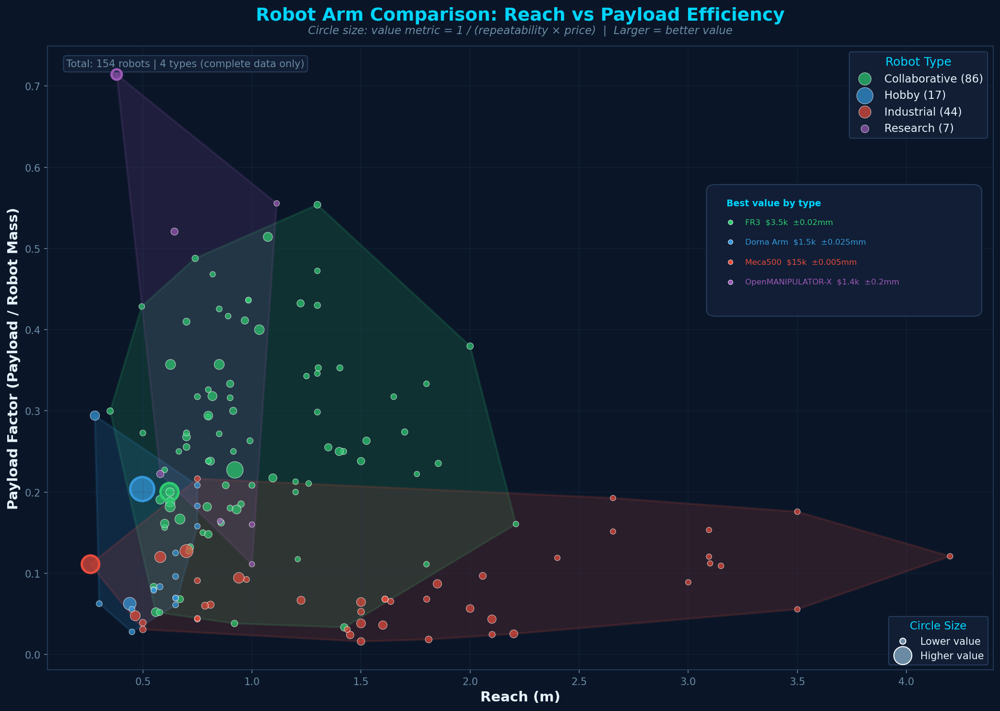
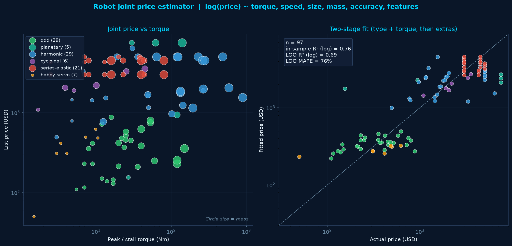

# robot_arm_data

Research data about robot manipulators, scraped from public online sources.



## Dataset Overview

This dataset contains specifications for **127+ robot arms** across 4 categories with complete data (payload, reach, mass, repeatability, and price). The visualization above shows:

- **Reach vs Payload Factor** — Payload factor is the ratio of payload capacity to robot mass. Higher values indicate more efficient designs that can lift more relative to their own weight.
- **Color by Type** — Collaborative robots (green) cluster at shorter reaches with higher payload efficiency. Industrial robots (red) span wider reach ranges but with lower efficiency. Hobby (blue) and Research (purple) robots occupy smaller niches.
- **Circle Size = Value Metric** — Calculated as `1 / (repeatability × price)`. Larger circles represent better value: higher precision at lower cost.
- **Convex Hulls** — Shaded regions show the design space each robot type occupies, highlighting where categories overlap and compete.

## Data Sources

All data is collected from corporate websites, company catalogs, resellers, or random blog posts. I tried to make notes of strange sources in the additional notes column when necessary. Occasionally some of the estimates were in euros, so the conversion to dollars may be out of date.

Updated info is welcome via pull request.

## Running the Analysis App

This repo includes an interactive Streamlit app for exploring robot arm data, comparing payload factors, and estimating costs.

### Prerequisites

Install [pixi](https://pixi.sh) if you haven't already:

```bash
curl -fsSL https://pixi.sh/install.sh | bash
```

### Running the App

From the project directory, run:

```bash
pixi run app
```

This will start a local Streamlit server and open the app in your browser at `http://localhost:8501`.

### Features

- **Interactive filtering** by robot type (Articulated, Collaborative, Delta, SCARA, etc.)
- **Parameter sliders** for DOF, reach, payload, and repeatability
- **Auto-estimation** of robot mass and cost using regression models trained on the dataset
- **Payload factor visualization** comparing your configuration against real robots
- **Cost analysis** with price-per-DOF calculations

### Regenerating the Summary Plot

To regenerate the `robot_arm_summary.png` image:

```bash
pixi run plot
```

## Joint modules

The same repo also tracks **complete robot joints** (motor + gear + encoder, usually with a driver) in `data/robot_joint_data.csv`.



### Dataset

**138 modules** from 18 manufacturers, in six classes: harmonic (63), QDD (31), series-elastic (21), planetary (9), hobby-servo (8), cycloidal (6).

`Cost_USD` is a one-off street or quote price. `Cost_Flag` says how it was filled:

- **listed** (81) — shop or official list price
- **user** (12) — Maxon HDT ~$5k and HEJ $7.5k quotes
- **estimate** (45) — analog / brand-ladder fill for quote-only catalog parts (Harmonic Drive FHA/SHA, Leaderdrive, Nidec, HIWIN, leftover eRob, etc.)

Empty spec cells stay empty when a datasheet does not publish them. Notes cite the source.

### Price estimator

The joint app fits a two-stage log-price model on **listed + user rows only** (93 training points). Estimates are shown in the CSV but are not used to train.

- Stage 1: `log(price) = a[type] + b·log(torque) + c·log(1/accuracy)`
- Stage 2: weakly regularized residual on speed, size, mass, encoder, brake, driver
- Accuracy is a class default (harmonic 0.25 arcmin, QDD 12, etc.) unless you override it
- Current fit: in-sample R²(log) **0.78**, leave-one-out R² **0.70**, LOO MAE **~$940**
- Torque elasticity is shallow (~0.19): class (QDD vs harmonic vs SEA) moves price more than Nm
- Example: 20 Nm QDD, 90 mm, 0.6 kg → **~$315**. A 50 Nm harmonic in a similar envelope → **~$2.2k**

```bash
pixi run joint-app
pixi run joint-analyze
pixi run python analyze_joint_prices.py --torque 20 --speed 120 --od 90 --mass 0.6 --type qdd
```

`joint-app` is a Streamlit estimator with the same dark theme as the arm app. `joint-analyze` reprints the fit and regenerates `robot_joint_price_fit.png`. Do not insert a bare `--` between the pixi task and argparse flags.
