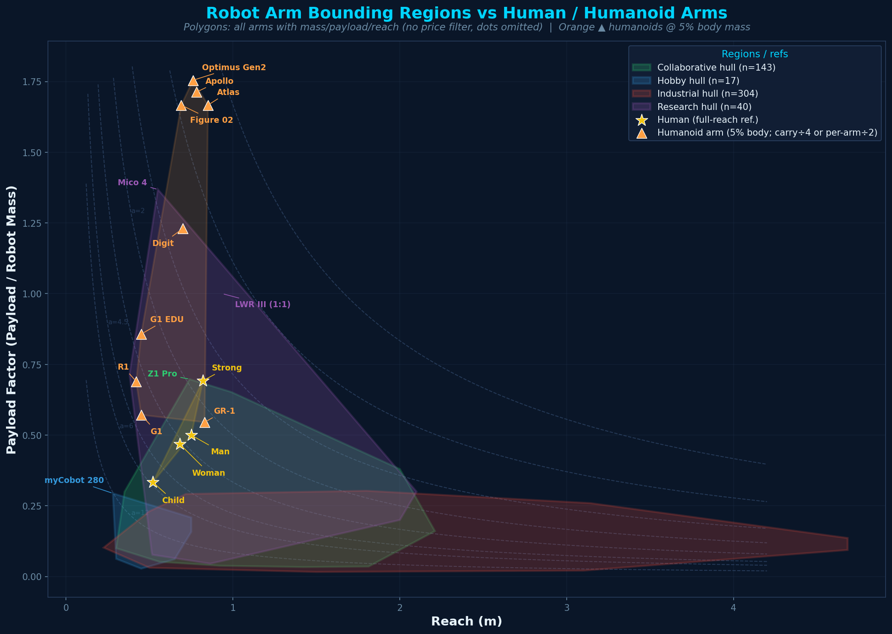
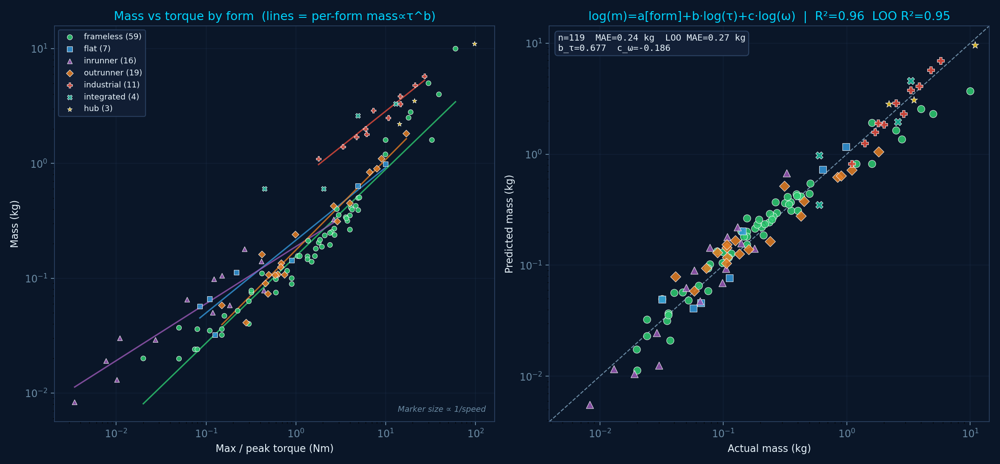
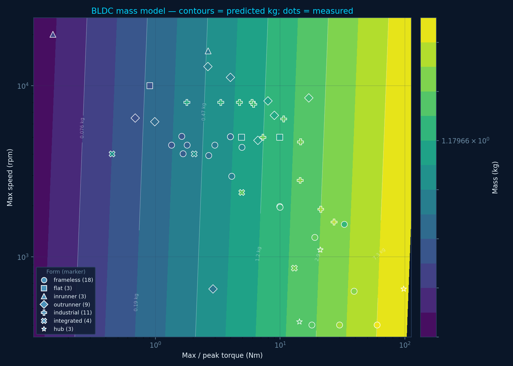
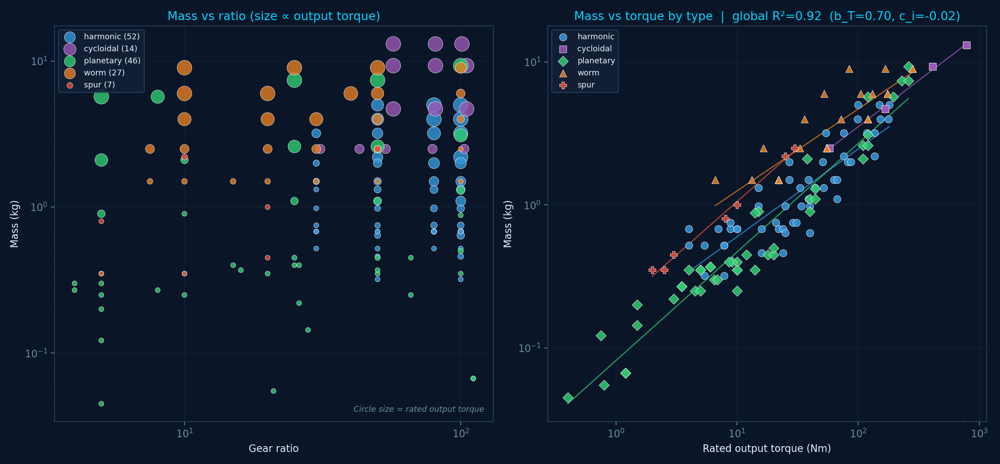
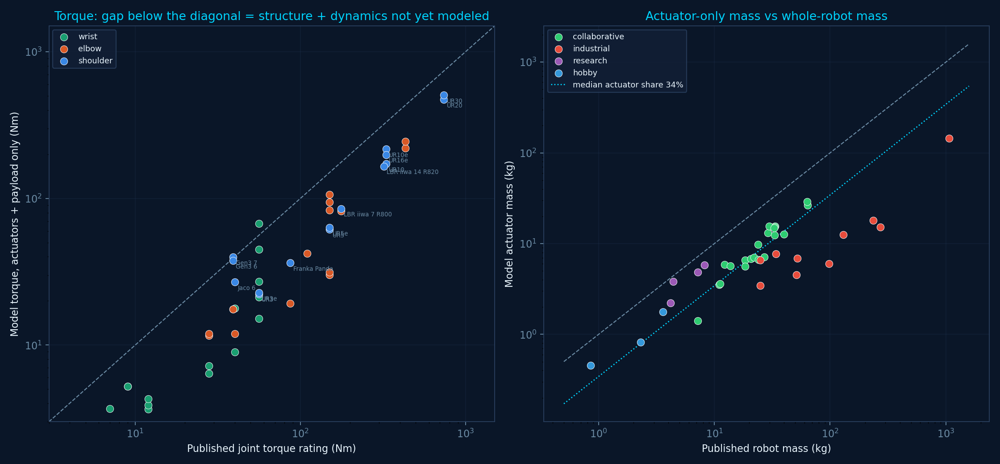
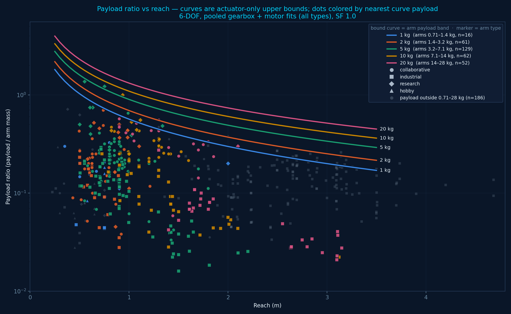

# robot_arm_data

Research data about robot manipulators, scraped from public online sources.


## Dataset Overview

This dataset contains specifications for hundreds of robot arms across 4 categories (`collaborative`, `industrial`, `research`, `hobby`). Regenerate the three summary figures with `pixi run plot`.

### Summary plot (`robot_arm_summary.png`)

- **Reach vs Payload Factor** — Payload factor is `payload / robot mass`. Higher values indicate more efficient designs that can lift more relative to their own weight.
- **Color by Type** — Collaborative (green), industrial (red), hobby (blue), research (purple).
- **Convex Hulls** — Shaded regions use **every** arm in that type with mass, payload, and reach (~500 rows). Price is **not** required for hull membership.
- **Dots** — Placed only when **price and repeatability** are both known (~160 rows). Circle size is the value metric `1 / (repeatability × price)` (larger = better value). Legend counts are `priced-dots / hull-members`.

### High payload-efficiency box (`robot_arm_high_pf.png`)

Zoom on arms with **PF > 0.4** and **reach < 2 m**:

- Includes **every** arm with mass/payload/reach in that box — **price and repeatability are not required** (so unpriced research peaks like **Mico 4** / **Jaco 4** / **LWR III** appear).
- Hulls and dots use that same high-PF set; the purple research region extends up to the highest-PF vertex in the box.
- Yellow dashed vertical marks **adult male arm reach (0.75 m)** from the human reference used in the humanoid comparison figure.

### Human & humanoid comparison (`robot_arm_human_comparison_hulls.png`)



Compares **serial robot-arm design space** to **human** and **humanoid** arm references on the same axes (reach vs payload factor):

- **Type convex hulls** from every arm with mass, payload, and reach (~500 rows)
- **Dots** for every arm with payload in the humanoid range (**1–7.5 kg**), priced or not. They're coloured by robot type, all the same size, with no price or repeatability weighting (201 of ~500 arms).
- **Human** references (yellow ★) and **humanoid** arm estimates (orange ▲)
- Landmark labels: **LWR III (1:1)**, **Mico 4** (research), collaborative max, **myCobot 280**
- **Cyan band**: the actuator-only payload-ratio bound from `arm_mass_model.py` (no structure). It uses the pooled `all` gearbox + motor fits, SF 1.0, and yaw/roll joints at 50 %, for a 7-DOF arm. The band spans the humanoid payload range (**1–7.5 kg** per arm at full reach, after the derates below).
  - **Solid** = the full arm, including both shoulder actuators.
  - **Dashed** = shoulder yaw + pitch actuators removed. On a humanoid those sit in the torso and aren't part of the ~5 % arm mass, so this is the fairer comparison.

  Optimus, Figure 02, Apollo and Atlas (5–7.5 kg) sit *above* the solid band but well inside the dashed band. Their arm-mass estimate only works if the shoulder actuators are counted as torso mass.

Human/humanoid reference numbers live in `data/human_humanoid_arm_data.csv`. The hull figure applies the humanoid assumptions below at plot time (it does not rewrite that CSV).

### Assumptions (humanoids)

All humanoids are treated as one family (orange) with a shared mass rule:

1. **Arm mass ≈ 5% of whole-robot body mass**  
   Used for G1 / G1 EDU / R1 / GR-1 / Optimus Gen2 / Figure 02 / Apollo / Digit / Atlas.

2. **Published “carry” ratings are whole-robot, close-to-body**  
   For Optimus, Figure, Apollo, Digit, and Atlas we convert to a **single-arm, full-reach** estimate as:
   - ÷2 for two arms sharing the load  
   - ÷2 again because carry is near the torso, not at full reach  
   - → **per-arm full-reach payload ≈ carry / 4**

   | Robot | Published carry | Per-arm full-reach (÷4) |
   |---|---|---|
   | Optimus Gen2 | 20 kg | 5.0 kg |
   | Figure 02 | 20 kg | 5.0 kg |
   | Apollo | 25 kg | 6.25 kg |
   | Digit | 16 kg | 4.0 kg |
   | Atlas | 30 kg sustained | 7.5 kg |

3. **Official one-arm ratings** (Unitree G1 / G1 EDU / R1, Fourier GR-1) are already per-arm; we only apply a **÷2 full-reach derate** (not the bimanual ÷2).

4. **Reach** for the five “leading” platforms is a **pixel estimate** from full-body photos (shoulder → hand / fingertip scaled by published height). Atlas uses a human-proportioned estimate (~0.44 × stature) when a clean arms-down photo was unavailable. BD’s published **2.3 m** figure is treated as whole-body workspace reach, not shoulder→hand arm length.

5. **Humans** use separate anthropometric estimates (not the 5% humanoid rule): continuous full-reach hold payloads and shoulder→fingertip reaches for Child / Woman / Man (**0.75 m**) / Strong.

6. These humanoid points are **illustrative**, not datasheet arm specs. Payload factor above ~1 is rare for production serial arms (DLR **LWR III** is the classic research 1:1; Kinova arms are classified here as **research** for separation from cobot fleets — **Mico 4** / **Jaco 4** exceed PF 1 mainly on mid-range continuous ratings with light structures).

### Assumptions (robot hulls)

- Payload factor = `Payload_kg / Weight_kg` using the CSV values as published (no carry÷4 derate on industrial/cobot rows).
- Hull vertices are the convex hull of each `Type` in reach–PF space after dropping rows missing reach, mass, or payload.
- On the summary and humanoid-comparison figures, dots still require price + repeatability; the high-PF zoom does **not**.

```bash
pixi run plot
```

Outputs: `robot_arm_summary.png`, `robot_arm_high_pf.png`, `robot_arm_human_comparison_hulls.png`.

## Data Sources

All data is collected from corporate websites, company catalogs, resellers, or random blog posts. I tried to make notes of strange sources in the additional notes column when necessary. Occasionally some of the estimates were in euros, so the conversion to dollars may be out of date.

Updated info is welcome via pull request.

## Running the Analysis App

This repo includes an interactive Streamlit app for exploring robot arm data, comparing payload factors, and estimating costs.

### Prerequisites

Install [pixi](https://pixi.sh) if you haven't already:

```bash
curl -fsSL https://pixi.sh/install.sh | bash
```

### Running the App

From the project directory, run:

```bash
pixi run app
```

This will start a local Streamlit server and open the app in your browser at `http://localhost:8501`.

### Features

- **Interactive filtering** by robot type (Articulated, Collaborative, Delta, SCARA, etc.)
- **Parameter sliders** for DOF, reach, payload, and repeatability
- **Auto-estimation** of robot mass and cost using regression models trained on the dataset
- **Payload factor visualization** comparing your configuration against real robots
- **Cost analysis** with price-per-DOF calculations

### Regenerating plots

```bash
pixi run plot
```

This runs `generate_summary_plot.py` and writes the three arm figures described above (summary, high-PF zoom with Man-reach line, human/humanoid hull comparison).

## Joint modules

The same repo also tracks **complete robot joints** (motor + gear + encoder, usually with a driver) in `data/robot_joint_data.csv`.


### Dataset

**142 modules** from 19 manufacturers, in six classes: harmonic (67), QDD (31), series-elastic (21), planetary (9), hobby-servo (8), cycloidal (6).

`Cost_USD` is a one-off street or quote price. `Cost_Flag` says how it was filled:

- **listed** — shop, Alibaba sample, or official list price
- **user** — Maxon HDT ~$5k and HEJ $7.5k quotes
- **estimate** — analog / brand-ladder fill for quote-only catalog parts (Harmonic Drive FHA/SHA, Leaderdrive, Nidec, HIWIN, leftover eRob, etc.)

Empty spec cells stay empty when a datasheet does not publish them. Notes cite the source.

### Price estimator

The joint app fits a two-stage log-price model on **listed + user rows only** (97 training points). Estimates are shown in the CSV but are not used to train.

- Stage 1: `log(price) = a[type] + b·log(torque) + c·log(1/accuracy)`
- Stage 2: weakly regularized residual on speed, size, mass, encoder, brake, driver
- Accuracy is a class default (harmonic 0.25 arcmin, QDD 12, etc.) unless you override it
- Current fit: in-sample R²(log) **0.77**, leave-one-out R² **0.69**, LOO MAE **~$950**
- Torque elasticity is shallow (~0.19): class (QDD vs harmonic vs SEA) moves price more than Nm
- Example: 20 Nm QDD, 90 mm, 0.6 kg → **~$316**. A 50 Nm harmonic in a similar envelope → **~$2.1k**

```bash
pixi run joint-app
pixi run joint-analyze
pixi run python analyze_joint_prices.py --torque 20 --speed 120 --od 90 --mass 0.6 --type qdd
```

`joint-app` is a Streamlit estimator with the same dark theme as the arm app. `joint-analyze` reprints the fit and regenerates `robot_joint_price_fit.png`. Do not insert a bare `--` between the pixi task and argparse flags.

## BLDC motors

Bare brushless motors (not geared joint modules) live in `data/bldc_motor_data.csv`.





### Dataset

**120 motors** (119 used in the fit: listed mass + peak torque + max speed). Sources span CubeMars (frameless RI/RO + GL gimbal), Maxon (EC / ECX SPEED / ECX FLAT), Faulhaber (micro through 32 mm), Kollmorgen (AKM2G LV), Teknic ClearPath, ODrive, T-Motor, plus **AliExpress/Alibaba OEM** (MOSRAC/TSL U-series, SteadyWin WK/GB, Maintex LW, Honpine FM1, XRobotek XMD031, Flipsky, HXC, scooter/QS hubs). Dense below **5 Nm** (~94 rows), especially **&lt;1 Nm** (~54 rows).

| Peak torque | Count |
|---|---|
| &lt;0.05 Nm | 6 |
| 0.05–0.2 | 18 |
| 0.2–0.5 | 15 |
| 0.5–1 | 15 |
| 1–2 | 12 |
| 2–5 | 28 |
| 5–10 | 9 |
| 10+ | 17 |

| Form | Count | Role in catalog |
|---|---|---|
| **frameless** | 59 | Robot joint kits (CubeMars, MOSRAC, Honpine, …) |
| **outrunner** | 19 | Prop / gimbal / hub-adjacent BLDC |
| **inrunner** | 16 | Precision micros (Maxon ECX SPEED, Faulhaber) |
| **industrial** | 11 | Packaged servos (Kollmorgen AKM2G) |
| **flat** | 7 | Maxon EC / ECX FLAT pancakes |
| **integrated** | 4 | ClearPath-style drive-in-motor |
| **hub** | 3 | Wheel / hub motors |

Core fields:

- **Max_Torque_Nm** — peak / stall / short-term max (primary torque for the mass model)
- **Max_Speed_rpm** — no-load or catalog max speed
- **Weight_kg** — published motor mass (`Weight_Flag=listed`, or `estimate` when only a class analog exists)
- **Form** — categorical form used as the type dummy (like gearbox `Type`)
- Optional: continuous torque, OD/length, Kv, pole pairs, voltage, street price

Notes cite the catalog / shop page. Empty cells mean the source did not publish that number.

### Mass models

Same pattern as the gearbox type model: a shared torque/speed slope with a **form-specific intercept**, plus optional per-form `mass∝τ^b` lines on the plot.

#### 1. Form-aware global (primary estimator)

```
log(mass) = a[form] + b · log(τ_max) + c · log(ω_max)
```

Current fit (n=119 listed-mass rows):

| | Value |
|---|---|
| **b** (torque) | **+0.677** |
| **c** (speed) | **−0.186** |
| R²(log) | **0.956** |
| LOO R² | **0.947** |
| MAE | **0.241 kg** |
| LOO MAE | **0.275 kg** |

Effective intercepts `a[form]` (log-mass units; lower = lighter for the same τ, ω):

| Form | a[form] | n |
|---|---|---|
| frameless | −0.348 | 59 |
| outrunner | −0.182 | 19 |
| flat | +0.181 | 7 |
| hub | +0.365 | 3 |
| inrunner | +0.744 | 16 |
| integrated | +1.036 | 4 |
| industrial | +1.079 | 11 |

So for a given torque/speed, **frameless / outrunner are lightest**; **industrial / integrated are heaviest** (~4× heavier than frameless at the same point). Example at **τ = 2 Nm, ω = 4000 rpm**:

| Form | Estimated mass |
|---|---|
| frameless | **0.24 kg** |
| outrunner | 0.29 kg |
| flat | 0.41 kg |
| inrunner | 0.72 kg |
| industrial | **1.01 kg** |

#### 2. Pooled (no form) — contour backdrop

```
log(mass) = a + b · log(τ_max) + c · log(ω_max)
```

Used only for the torque–speed **contour map** (one surface for all forms). Weaker than the form-aware model: R²(log) **0.868**, LOO R² **0.861**, MAE **0.429 kg**. Contours are nearly vertical → mass is mostly a torque story once form is ignored.

#### 3. Per-form torque lines (plot overlays)

For each form with **≥5** rows, a simple `log(m) = a + b·log(τ)` is fit and drawn on the left panel of `robot_motor_mass_fit.png` (colored line matching the dots). Speed-only slopes are printed for diagnostics but are weak for most forms.

| Form | mass ∝ τ^b | R² | MAE | n |
|---|---|---|---|---|
| outrunner | **τ^0.79** | 0.95 | 0.04 kg | 19 |
| frameless | **τ^0.76** | 0.93 | 0.29 kg | 59 |
| flat | **τ^0.63** | 0.93 | 0.04 kg | 7 |
| industrial | **τ^0.62** | 0.95 | 0.27 kg | 11 |
| inrunner | **τ^0.50** | 0.88 | 0.02 kg | 16 |

`integrated` and `hub` are too sparse (&lt;5 rows) for a per-form line; they still get a global `a[form]` intercept in the primary estimator.

### Plots

- **`robot_motor_mass_fit.png`** — left: mass vs peak torque by form (marker size ∝ 1/speed), with per-form `mass∝τ^b` lines; right: form-aware predicted vs actual (identity line, R²≈0.96).
- **`robot_motor_mass_contour.png`** — pooled mass contours on the τ–ω plane; dots are measured motors colored by mass, shaped by form.

```bash
pixi run motor-analyze
pixi run python analyze_motor_mass.py --torque 2.0 --speed 4000 --form frameless
```

## Gearboxes / reducers

Bare reducers (not full joint modules) live in `data/gearbox_data.csv`.



### Dataset

**~146 reducers** spanning ratios **~4:1–100:1** (a few up to 111:1), sized so **rated input torque** overlaps the motor set (~0.01–40 Nm input; ~94 rows in the 0.5–30 Nm motor-matched band).

| Type | Sources | Notes |
|---|---|---|
| **harmonic** | Harmonic Drive CSF-2UH / LW; AliExpress HBK/SHF | Mass fixed per frame across 30/50/80/100 |
| **cycloidal** | Nabtesco RV-E | Heavy, high torque; mass per frame |
| **planetary** | Neugart PLE; Maxon GPX; AliExpress FLE42/GP42 | 1-stage ≈ QDD (5–10); 2–3 stage for 25–100 |
| **worm** | NMRV 030–075 | Mass fixed per size; ratios 7.5–100 |
| **spur** | Small industrial / Boston-class analogs | Thin coverage |

Core fields: `Ratio`, `Stages`, `Rated_Output_Torque_Nm`, `Weight_kg`, `OD_mm`, `Length_mm`, derived `Rated_Input_Torque_Nm ≈ T_out / ratio`. Price filled where street listings were clear.

### Mass / size model

Important empirical result: **within a frame, mass barely changes with ratio**. Ratio alone is a weak predictor; **output torque capacity (frame size) and type** dominate:

```
log(mass) = a[type] + b · log(T_out) + c · log(ratio)
```

Typical fit on this set: **b ≈ 0.70**, **c ≈ −0.02**, R²(log) **~0.92**. Per-type mass∝T^b: harmonic ~0.61, planetary ~0.76, worm ~0.57, cycloidal ~0.65. Mass∝ratio alone has R² ≈ 0 for harmonic/worm.

```bash
pixi run gearbox-analyze
pixi run python analyze_gearbox_mass.py --ratio 50 --torque-out 40 --type harmonic
```

Writes `robot_gearbox_mass_fit.png` (mass vs ratio + mass vs torque by type) and `robot_gearbox_od_fit.png` (housing OD vs torque).

## Arm actuator mass model

Estimates **motor + gearbox mass for every joint of a 6- or 7-DOF arm** from just **reach** and **payload**. Actuators are sized one at a time, starting at the wrist and working back to the shoulder. Structure mass comes next. The loop already has a placeholder for it.



### Link-length heuristic

`data/arm_geometry_data.csv` holds published DH / dimension-drawing link lengths for **38 arms** (UR, Franka, iiwa, Kinova, xArm, Doosan, Techman, AUBO, ABB, KUKA, FANUC, Yaskawa, Stäubli, Trossen, …). Each arm is reduced to the lever chain seen by the pitch joints when stretched out horizontally: `shoulder offset → upper arm → forearm → wrist pitch→flange`. Base height (floor → shoulder pitch) is kept for drawing only. It never acts as a lever arm.

Median fractions of reach (chain length ≈ published reach, median ratio 1.04):

| Basis | n | upper | forearm | wrist | offset | base height |
|---|---|---|---|---|---|---|
| all | 38 | 0.44 | 0.42 | 0.14 | 0.00 | 0.27 |
| collaborative | 21 | 0.45 | 0.42 | 0.14 | 0.00 | 0.18 |
| industrial | 10 | 0.41 | 0.44 | 0.08 | 0.07 | 0.40 |
| research/hobby | 7 | 0.46 | 0.35 | 0.19 | 0.00 | 0.32 |

The fractions are roughly scale-free across 0.3–2.7 m reach (`robot_arm_geometry_fit.png`). The `Confidence` column flags rows from approximate drawings.

### Joint clusters and sizing chain

| Cluster | Joints (6-DOF) | 7-DOF adds | Sized by |
|---|---|---|---|
| wrist | forearm roll, wrist pitch, wrist roll | — | wrist pitch |
| elbow | elbow pitch | upper-arm roll | elbow pitch |
| shoulder | shoulder yaw, shoulder pitch | — | shoulder pitch |

Each cluster's sizing (pitch) joint carries the payload plus every actuator distal to it in the chain, with the arm horizontal. The other joints in the cluster don't carry that gravity moment: shoulder yaw, upper-arm roll, forearm roll and wrist roll. Each gets its own, smaller actuator, sized to a fraction of the sizing joint's torque. The default is **50 %**, set per joint with the GUI sliders or with `--secondary`. Because mass ∝ torque^~0.7, a 50 % joint weighs about 60 % of its pitch joint's actuator. The lighter roll actuators also reduce the load on every pitch joint closer to the base.

```
T = SF · g · [ m_payload · x_payload + Σ_distal m_i · x_i ]      (SF defaults to 1.0 = pure static)
τ_motor = T / (ratio · η[gearbox]),   ω_motor = ω_joint · ratio
m_actuator = k[gearbox] · ( m_gearbox(type, T, ratio) + m_motor(form, τ_motor, ω_motor) )
```

The wrist pitch carries its own cluster's wrist roll, so the sizing is a fixed-point iteration. The loop re-runs wrist → elbow → shoulder until no mass changes by more than 10 µg (typically 4–5 passes). `k` is an **integration factor** calibrated on `robot_joint_data.csv`: complete module mass ÷ predicted bare gearbox + motor. It comes out to 0.98 for harmonic, 0.96 for cycloidal, 0.65 for planetary/QDD, and 1.0 where there is no module data (worm/spur).

**Validation:** with each arm's real geometry, the actuator-only torques fall below the published joint ratings. That gap is the link structure and dynamics this model doesn't include yet. Model actuator mass is a median **~31 %** of whole-cobot mass (27 % across all arms). Industrial arms sit much lower because their castings are heavy.

### Payload-ratio upper bound



`payload_ratio_sweep()` sizes the arm for payloads of **1, 2, 5, 10 and 20 kg** at reaches from **0.25 to 3.5 m**. Each point is plotted as `payload / actuator mass`. The model has no structure mass, so each curve is the **best-case payload ratio** for that payload. A real arm should sit below its payload's curve.

The curves use the **`all`** gearbox and motor option, which is a pooled fit over every gearbox type and every motor form with no type term. It represents an average actuator design:

- **Gearbox:** `log m = −2.07 + 0.75·log T_out − 0.06·log ratio`, with ratio 50 (the data median) and η 0.77 (weighted by how many of each type are in the data)
- **Motor:** `log m = −1.94 + 0.75·log τ + 0.05·log ω`
- **Integration factor:** 0.69, calibrated across all joint modules

6-DOF, SF 1.0 (pure static), off-chain joints at 50 %:

| Reach | 1 kg | 2 kg | 5 kg | 10 kg | 20 kg |
|---|---|---|---|---|---|
| 0.25 m | 2.23 | 2.67 | 3.39 | 4.06 | 4.85 |
| 0.5 m | 1.28 | 1.54 | 1.97 | 2.36 | 2.83 |
| 1 m | 0.71 | 0.87 | 1.12 | 1.35 | 1.63 |
| 1.5 m | 0.50 | 0.61 | 0.80 | 0.97 | 1.17 |
| 2 m | 0.38 | 0.47 | 0.62 | 0.76 | 0.92 |
| 2.5 m | 0.31 | 0.39 | 0.51 | 0.62 | 0.76 |
| 3 m | 0.26 | 0.33 | 0.43 | 0.53 | 0.65 |
| 3.5 m | 0.22 | 0.28 | 0.38 | 0.46 | 0.57 |

Each curve has its own colour. Published arms are coloured by the curve whose payload is nearest theirs, using log-midpoint bands (0.71–1.4, 1.4–3.2, 3.2–7.1, 7.1–14 and 14–28 kg), so each dot can be compared against its own line. Arms outside 0.71–28 kg are gray, and marker shape shows arm type. In the GUI, the **Highlight payload band** buttons (all / 1 / 2 / 5 / 10 / 20 kg) bring one curve and its arms to the front, fade the rest, and count how many arms in that group fall below or above the line.

The ratio rises with payload because actuator mass grows like torque^0.7–0.75, which is sub-linear. For a single design, pick a specific gearbox and motor (`--gearbox harmonic --motor frameless`, or the GUI buttons). The bound curves stay on `all`. For comparison, at 0.85 m / 5 kg, `all` + `all` gives 3.9 kg of actuators, harmonic + frameless 5.0 kg, and planetary + frameless 2.9 kg.

```bash
pixi run arm-mass                                    # 0.85 m / 5 kg example, validation + payload-ratio plots
pixi run python arm_mass_model.py --reach 1.3 --payload 10 --dof 7 --gearbox planetary --motor outrunner
pixi run geometry-analyze                            # refit fractions, robot_arm_geometry_fit.png
pixi run arm-mass-app                                # interactive GUI
```

The GUI (`arm_mass_app.py`) has reach/payload sliders and selector buttons for DOF, gearbox type, motor type and geometry basis. Gearbox and motor both default to `all`. It also has expanders for link-fraction overrides, safety factor, tool offset, per-cluster ratio / speed and a kg/m structure placeholder. It draws the arm with every actuator's mass called out, plus the motor/gearbox breakdown and the iteration history. The main chart plots **payload ratio against reach** for every published arm, with the 1–20 kg upper-bound curves drawn on top. The curves always use the `all` gearbox + motor. DOF, geometry, SF, speeds and structure follow the sidebar, and the gearbox/motor buttons move only the ★ for your specific design. It warns when a torque, ratio or speed falls outside the fitted motor/gearbox data.
